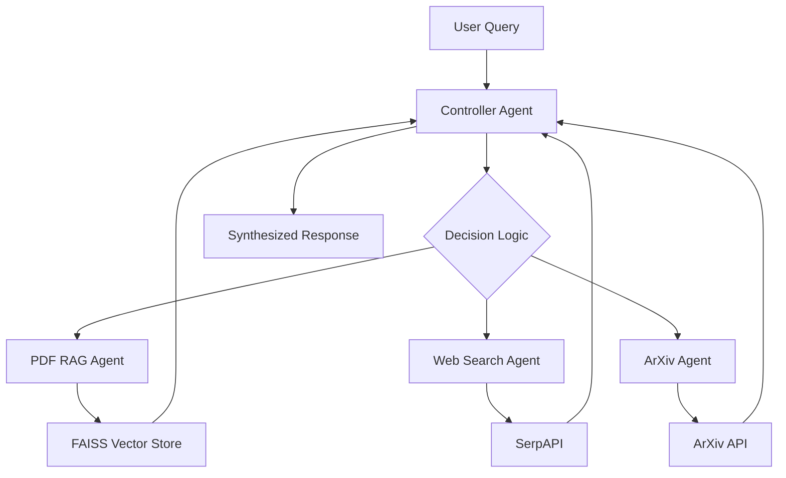

# Multi-Agent AI System with Dynamic Decision Making

This project implements a complete multi-agent AI system that dynamically decides which agent(s) to call for a user query. The system includes a FastAPI backend, a minimal frontend, and uses various agents for processing different types of queries.

## Features

- **Controller Agent**: Makes decisions on which agents to use based on the query
- **PDF RAG Agent**: Processes PDF uploads and performs retrieval-augmented generation
- **Web Search Agent**: Performs real-time web searches using SerpAPI
- **ArXiv Agent**: Searches and summarizes recent academic papers
- **LLM Integration**: Uses Groq API for enhanced decision making and response synthesis
- **Logging**: Tracks all decisions and agent interactions
- **Frontend**: Minimal UI with search box, PDF upload widget, and results display

## Architecture



## Setup

1. Clone the repository
2. Install dependencies:
   ```bash
   pip install -r requirements.txt
   ```
3. Set up environment variables in `.env` file with your API keys:
   - `GROQ_API_KEY` - For LLM decision making and response synthesis
   - `GOOGLE_AI_API_KEY` - For Google AI Studio integration
   - `SERPAPI_API_KEY` - For web search capabilities
4. Run the application:
   ```bash
   python start_system.py
   ```

## API Endpoints

- `POST /ask` - Ask a question to the multi-agent system
- `POST /upload_pdf` - Upload a PDF for RAG processing
- `GET /logs` - Retrieve system logs

## Agents

### Controller Agent
The controller uses a hybrid approach combining rule-based logic with LLM-based decision making:
- Rule-based routing for quick decisions
- LLM-enhanced routing for complex queries (when Groq API is available)
- Response synthesis using LLM for coherent answers (when Groq API is available)

### PDF RAG Agent
Processes PDF files using:
- PyMuPDF (fitz) for text extraction
- Sentence Transformers for embeddings
- FAISS for similarity search

### Web Search Agent
Uses SerpAPI for web searches with real-time information retrieval.

### ArXiv Agent
Queries the ArXiv API for recent academic papers.

## Frontend Features

The minimal frontend includes:
- **Search Box**: Text area for entering questions
- **PDF Upload Widget**: File input for uploading PDF documents
- **Result Area**: Displays final answer, agents used, and decision rationale
- **Logs Section**: Shows recent system interactions

## Deployment

### Hugging Face Spaces
See [HF_DEPLOYMENT.md](HF_DEPLOYMENT.md) for detailed deployment instructions.

### Docker
The application can be deployed using the provided Dockerfile:
```bash
docker build -t multi-agent-ai .
docker run -p 8000:8000 multi-agent-ai
```

## Sample NebulaByte PDFs

The `sample_pdfs/` directory contains 5 sample PDFs generated from NebulaByte dialogs for demonstration purposes.

## Security

- PDF uploads are limited to 10MB
- Files are processed in memory and not stored permanently

## Project Structure

```
multi-agent-system/
├── app/
│   ├── agents/           # Agent implementations
│   ├── api/              # API routes
│   ├── models/           # Data models
│   └── config/           # Configuration
├── sample_pdfs/          # Sample PDFs for RAG
├── uploads/              # Uploaded PDFs (created at runtime)
├── logs/                 # Log files (created at runtime)
├── main.py               # FastAPI application entry point
├── frontend.html         # Minimal frontend interface
├── start_system.py       # Script to start both backend and frontend
├── requirements.txt      # Python dependencies
├── Dockerfile            # Docker configuration
├── README.md             # This file
├── HF_DEPLOYMENT.md      # Hugging Face deployment instructions
├── REPORT.pdf            # Detailed architecture report
└── .env                  # Environment variables
```

## Running the Application

### Option 1: Using the startup script (Recommended)
```bash
python start_system.py
```
This will start both the backend API and frontend server, and open your browser to the frontend interface.

### Option 2: Manual start
1. Start the backend:
   ```bash
   uvicorn main:app --reload
   ```

2. In a separate terminal, serve the frontend:
   ```bash
   python -m http.server 8080
   ```

3. Open your browser to `http://localhost:8080/frontend.html`

## Testing

Run the verification script to check if all components are working:
```
python final_verification.py
```

## Requirements

- Python 3.8+
- See `requirements.txt` for Python package dependencies

## License

This project is licensed under the Apache 2.0 License - see the LICENSE file for details.