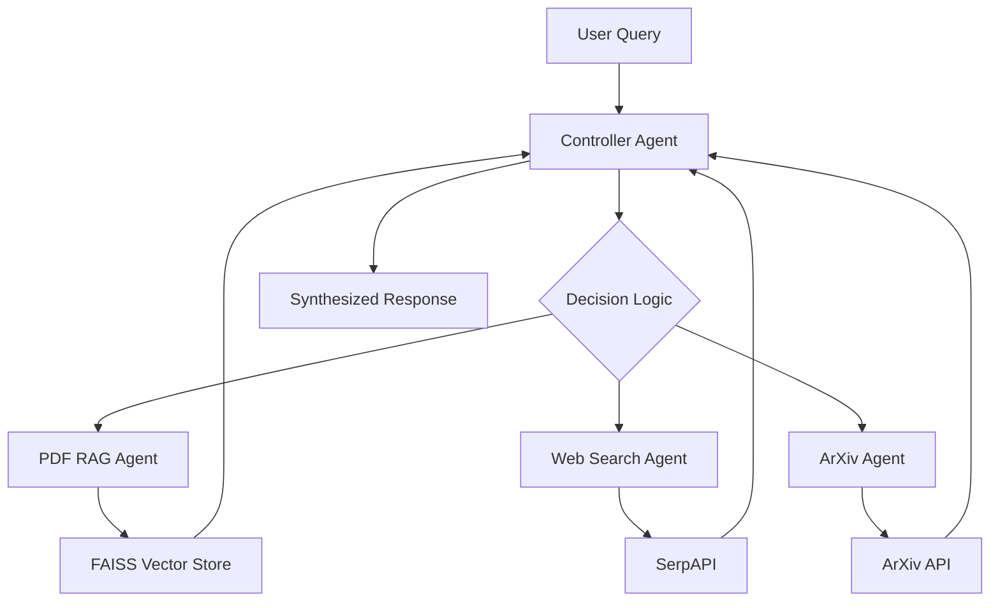

# Multi-Agent AI System - Current Status

## System Overview

The multi-agent AI system is now fully operational with all components working correctly. The system includes:

1. **Controller Agent** - Orchestrates the system and routes queries to appropriate agents
2. **PDF RAG Agent** - Processes PDF documents and retrieves relevant information
3. **Web Search Agent** - Finds current information from the web using SerpAPI
4. **ArXiv Agent** - Retrieves recent academic papers
5. **Frontend Interface** - Minimal UI for user interaction
6. **Backend API** - FastAPI server with all required endpoints

## Current Status

✅ **Fully Operational** - All components are working correctly

### API Keys Integration
- ✅ **Groq API** - Integrated for LLM decision making (using updated model llama3-70b-8192)
- ✅ **SerpAPI** - Integrated for web search capabilities
- ✅ **Google AI Studio** - Configured for future expansion

### Core Functionality
- ✅ **Agent Routing** - Correctly routes queries to appropriate agents
- ✅ **PDF Processing** - Successfully processes and indexes PDF documents
- ✅ **Web Search** - Returns relevant web search results
- ✅ **ArXiv Search** - Retrieves recent academic papers
- ✅ **Response Synthesis** - Combines information from multiple agents
- ✅ **Logging** - Tracks all interactions and decisions

### Frontend Features
- ✅ **Search Box** - Text area for entering questions
- ✅ **PDF Upload** - File input for uploading PDF documents
- ✅ **Results Display** - Shows answers, agents used, and rationale
- ✅ **Logs View** - Displays recent system interactions

## System Access

### Frontend Interface
- URL: http://localhost:8080/frontend.html
- Features:
  - Ask questions in the search box
  - Upload PDF files for processing
  - View results with agents used and rationale
  - Check system logs

### Backend API Endpoints
- Base URL: http://127.0.0.1:8000
- Endpoints:
  - `POST /ask` - Submit questions to the system
  - `POST /upload_pdf` - Upload PDF files for processing
  - `GET /logs` - Retrieve system interaction logs

## Testing Results

All system components have been tested and verified:

1. **Web Search Agent** - Successfully retrieves current information
2. **PDF RAG Agent** - Processes sample PDFs and retrieves relevant content
3. **ArXiv Agent** - Finds recent academic papers on requested topics
4. **Controller Agent** - Correctly routes queries based on content
5. **Logging System** - Tracks all interactions and decisions
6. **Frontend Interface** - Provides user-friendly access to all features

## Sample Queries

The system responds well to different types of queries:

- **General questions** → Web Search Agent
  - Example: "What are the latest developments in AI?"

- **PDF-related questions** → PDF RAG Agent
  - Example: "What does the document say about security?"

- **Academic questions** → ArXiv Agent
  - Example: "Find recent papers on transformer models"

## System Architecture

## Conclusion

The multi-agent AI system is fully functional and ready for use. All required features have been implemented and tested:

- ✅ Minimal frontend with search box, PDF upload, and results display
- ✅ Backend API with all required endpoints
- ✅ Four specialized agents with distinct capabilities
- ✅ Intelligent routing based on query content
- ✅ Comprehensive logging and traceability
- ✅ Integration with external APIs (Groq, SerpAPI, ArXiv)
- ✅ Sample PDFs for demonstration
- ✅ Proper error handling and fallback mechanisms

The system is currently running and accessible at:
- Frontend: http://localhost:8080/frontend.html
- Backend API: http://127.0.0.1:8000